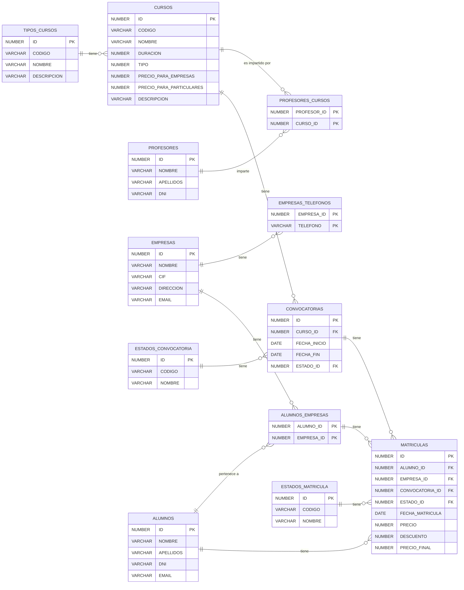

```mermaid
erDiagram
    Direction LR

    TIPOS_CURSOS {
        NUMBER ID PK
        VARCHAR CODIGO
        VARCHAR NOMBRE
        VARCHAR DESCRIPCION
    }

    CURSOS {
        NUMBER ID PK
        VARCHAR CODIGO
        VARCHAR NOMBRE
        NUMBER DURACION
        NUMBER TIPO
        NUMBER PRECIO_PARA_EMPRESAS
        NUMBER PRECIO_PARA_PARTICULARES
        VARCHAR DESCRIPCION
    }

    TIPOS_CURSOS ||--o{ CURSOS : "tiene"

    PROFESORES {
        NUMBER ID PK
        VARCHAR NOMBRE
        VARCHAR APELLIDOS
        VARCHAR DNI
    }

    PROFESORES_CURSOS {
        NUMBER PROFESOR_ID PK 
        NUMBER CURSO_ID PK
    }

    PROFESORES ||--o{ PROFESORES_CURSOS : "imparte"
    CURSOS ||--o{ PROFESORES_CURSOS : "es impartido por"

    EMPRESAS {
        NUMBER ID PK
        VARCHAR NOMBRE
        VARCHAR CIF
        VARCHAR DIRECCION
        VARCHAR EMAIL
    }
    EMPRESAS_TELEFONOS {
        NUMBER EMPRESA_ID PK
        VARCHAR TELEFONO PK
    }
    EMPRESAS ||--o{ EMPRESAS_TELEFONOS : "tiene"

    ESTADOS_CONVOCATORIA {
        NUMBER ID PK
        VARCHAR CODIGO
        VARCHAR NOMBRE
    }

    CONVOCATORIAS {
        NUMBER ID PK
        NUMBER CURSO_ID FK
        DATE FECHA_INICIO
        DATE FECHA_FIN
        NUMBER ESTADO_ID FK
    }

    ESTADOS_CONVOCATORIA ||--o{ CONVOCATORIAS : "tiene"
    CURSOS ||--o{ CONVOCATORIAS : "tiene"

    ALUMNOS {
        NUMBER ID PK
        VARCHAR NOMBRE
        VARCHAR APELLIDOS
        VARCHAR DNI
        VARCHAR EMAIL
    }

    ALUMNOS_EMPRESAS {
        NUMBER ALUMNO_ID PK
        NUMBER EMPRESA_ID PK
    }

    ALUMNOS ||--o{ ALUMNOS_EMPRESAS : "pertenece a"
    EMPRESAS ||--o{ ALUMNOS_EMPRESAS : "tiene"

    ESTADOS_MATRICULA {
        NUMBER ID PK
        VARCHAR CODIGO
        VARCHAR NOMBRE
    }

    MATRICULAS {
        NUMBER ID PK
        NUMBER ALUMNO_ID FK
        NUMBER EMPRESA_ID FK
        NUMBER CONVOCATORIA_ID FK
        NUMBER ESTADO_ID FK
        DATE FECHA_MATRICULA
        NUMBER PRECIO
        NUMBER DESCUENTO
        NUMBER PRECIO_FINAL
    }

    ALUMNOS ||--o{ MATRICULAS : "tiene"
    ALUMNOS_EMPRESAS ||--o{ MATRICULAS : "tiene"
    CONVOCATORIAS ||--o{ MATRICULAS : "tiene"
    ESTADOS_MATRICULA ||--o{ MATRICULAS : "tiene"

```